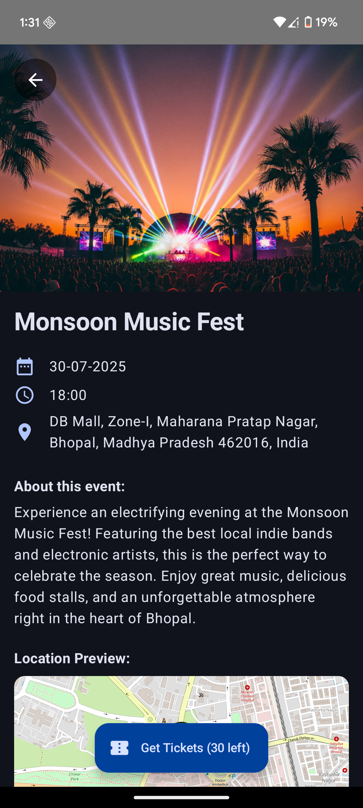

# Event Hive 🐝


Event Hive is a modern, feature-rich Android application for discovering, creating, and managing local events. Built entirely with Kotlin and Jetpack Compose, it provides a seamless, real-time experience for both event organizers and attendees, complete with a dynamic map, user authentication, and a secure (test mode) ticket booking flow.

This project was built from the ground up to demonstrate a full-stack mobile development process, incorporating a clean MVVM architecture, a live Firebase backend, and a professional, user-centric UI.

---

## ✨ Key Features

* **Real-time Event Creation & Discovery:** Users can create their own events, including details, images, and ticket information, which are instantly saved to a live cloud database.
* **User Authentication:** Secure sign-up and login functionality using **Firebase Authentication** with both Email/Password and Google Sign-In providers.
* **Cloud-Based Image Hosting:** Integration with **Cloudinary** for robust, cloud-based image hosting and delivery, ensuring fast and efficient media handling.
* **Dynamic Map View:** An interactive map screen built with **osmdroid** that displays events near the user based on a custom discovery radius set in their profile.
* **Location Autocomplete & Geo-querying:** Smart location search powered by Android's Geocoder and a custom-built geo-querying system to find nearby events.
* **Secure Ticket Booking Flow:** A complete, end-to-end ticket booking system that uses a **Firebase Cloud Function** to securely create payment orders with **Razorpay**.
* **Modern, Declarative UI:** The entire user interface is built with **Jetpack Compose**, following Material Design principles for a clean, intuitive, and responsive experience.
* **Clean Architecture:** The app is architected using the **MVVM pattern** (ViewModel, Repository) with StateFlow for reactive state management, ensuring a scalable and maintainable codebase.

---

## 📸 Screenshots

| Auth Screen                                       | Home Screen                                       | Add Event Screen                                  |
| ------------------------------------------------- | ------------------------------------------------- | ------------------------------------------------- |
|  |  |  |

| Map Screen                                        | Event Info Screen                                 | Ticket Screen                                     |
| ------------------------------------------------- | ------------------------------------------------- | ------------------------------------------------- |
|   |  |  |

---

## 🛠 Tech Stack & Libraries

* **Language:** [Kotlin](https://kotlinlang.org/)
* **UI:** [Jetpack Compose](https://developer.android.com/jetpack/compose)
* **Architecture:** MVVM (ViewModel, Repository, StateFlow)
* **Backend & Database:**
    * [Firebase Authentication](https://firebase.google.com/docs/auth)
    * [Cloud Firestore](https://firebase.google.com/docs/firestore)
    * [Firebase Cloud Functions](https://firebase.google.com/docs/functions)
* **Image Hosting:** [Cloudinary](https://cloudinary.com/)
* **Payment Gateway:** [Razorpay](https://razorpay.com/) (in Test Mode)
* **Mapping:** [osmdroid](https://github.com/osmdroid/osmdroid)
* **Image Loading:** [Coil](https://coil-kt.github.io/coil/)
* **Navigation:** [Jetpack Navigation for Compose](https://developer.android.com/jetpack/compose/navigation)
* **Animation:** [Lottie for Jetpack Compose](https://airbnb.io/lottie/)

---

## 🚀 Installation & Setup

To run this project locally, you will need to set up your own Firebase, Cloudinary, and Razorpay credentials.

**Prerequisites:**
* Android Studio (latest version recommended)
* A Firebase project
* A Cloudinary account
* A Razorpay account (in Test Mode)

**Installation Steps:**

1.  **Clone the repository:**
    ```bash
    git clone [https://github.com/imcoolthanyou/Event_Hive.git](https://github.com/imcoolthanyou/Event_Hive.git)
    ```

2.  **Open in Android Studio:** Open the cloned project in Android Studio.

3.  **Firebase Setup:**
    * Go to your Firebase project console.
    * Add a new Android app with the package name `gautam.projects.event_hive`.
    * Download the `google-services.json` file and place it in the `app/` directory of the project.

4.  **API Keys Setup:**
    * In the main package (`app/src/main/java/gautam/projects/event_hive/`), create a new Kotlin file named `ApiKeys.kt`.
    * Add your Cloudinary and Razorpay credentials to this file. **This file is included in `.gitignore` to keep your keys secure.**
        ```kotlin
        package gautam.projects.event_hive

        object ApiKeys {
            // Cloudinary
            const val CLOUDINARY_CLOUD_NAME = "YOUR_CLOUD_NAME_HERE"
            const val CLOUDINARY_API_KEY = "YOUR_API_KEY_HERE"
            const val CLOUDINARY_API_SECRET = "YOUR_API_SECRET_HERE"

            // Razorpay (Test Mode)
            const val RAZORPAY_TEST_KEY_ID = "YOUR_TEST_KEY_ID_HERE"
        }
        ```

5.  **Build and Run:** Build the project in Android Studio. It should now run on your emulator or physical device.

